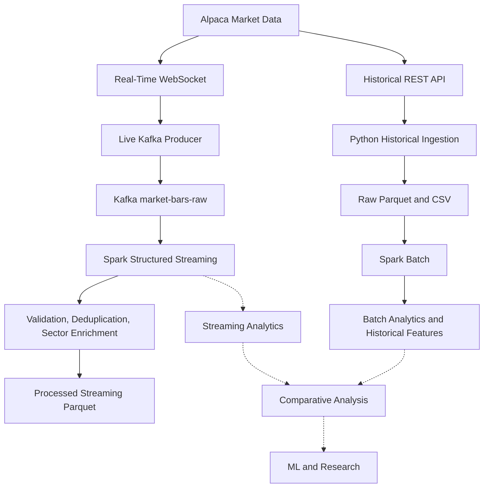
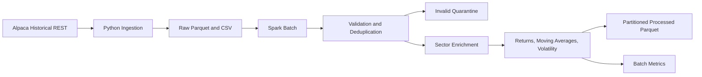
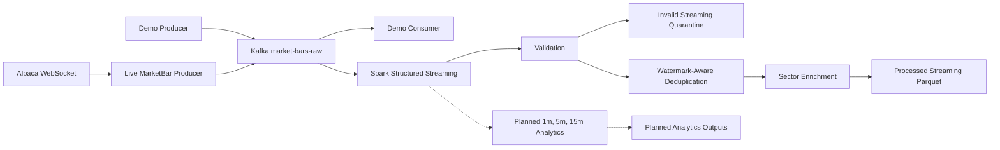
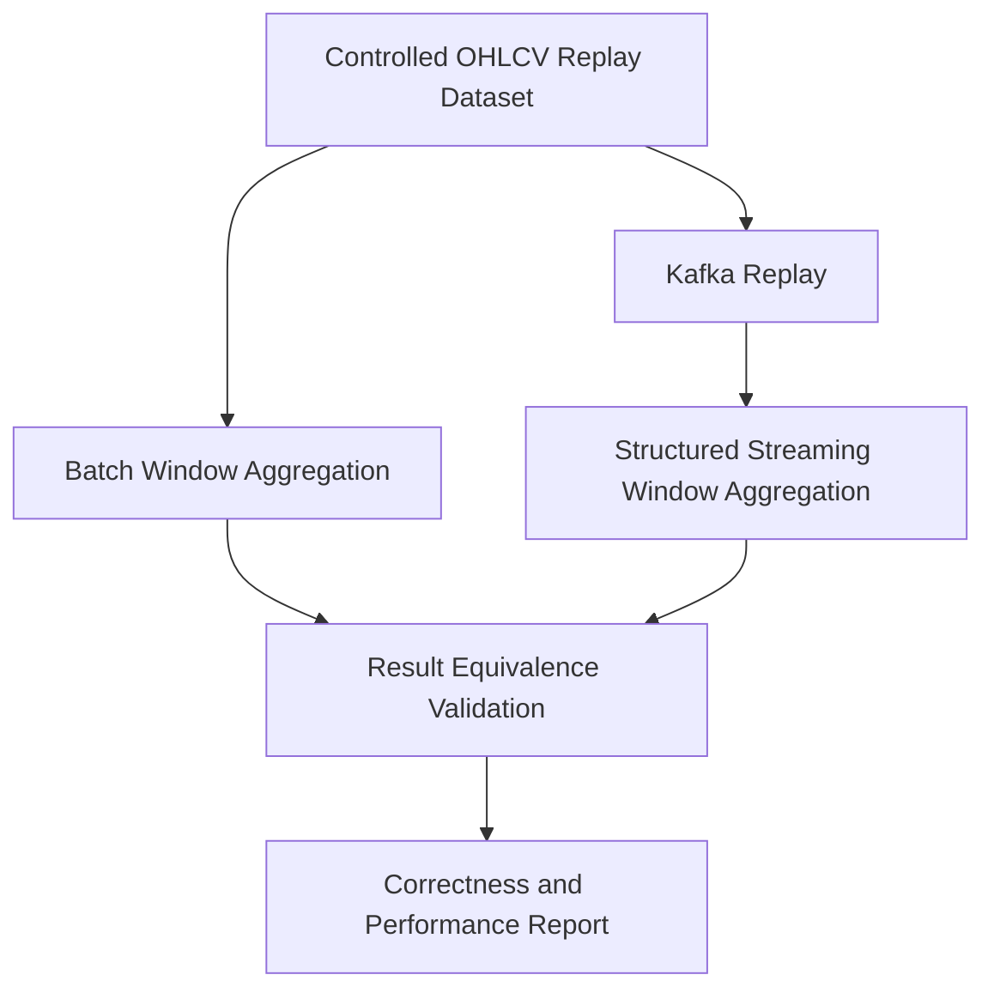

# Big Data Pipeline for Financial Market Analysis

## Project Objective

This university Big Data project studies financial market analysis through two
first-class processing paths: historical **Batch Analytics** and near-real-time
**Streaming Analytics**. Both paths use the same market domain, centralized symbol and
sector metadata, compatible OHLCV schemas, and equivalent mathematical definitions
wherever a metric exists in both modes.

The batch path is implemented through historical feature generation. The streaming
path is implemented through validated, deduplicated, sector-enriched event persistence:
Alpaca WebSocket, Kafka, and Spark Structured Streaming are runtime verified. Windowed
streaming analytics remain a planned phase.

## Academic Context

The scientific objective is to compare batch and streaming processing for correctness,
throughput, latency, completeness, resource use, and operational behavior. Later
experiments will replay equivalent market records through both paths and compare
windowed price, return, volume, and volatility results within defined numerical
tolerances. Existing batch benchmarks are preserved as baselines, not treated as
directly comparable to future streaming measurements until workload and environment
are controlled.

## Architecture Overview

Solid nodes describe implemented components. Dashed nodes describe planned work.

### Overall Architecture



### Batch Architecture



### Streaming Architecture



### Future Batch vs Streaming Comparison



## Technologies

- Python 3.11+
- Alpaca Market Data API v2
- pandas and PyArrow
- Apache Spark / PySpark 4.0.1
- Eclipse Temurin Java 21 LTS
- Apache Kafka 4.3.1 in KRaft mode
- Confluent Python client for Apache Kafka
- websockets 17.1 asynchronous client
- Docker Compose for local Kafka and Windows Spark runtime infrastructure
- YAML configuration and environment variables
- pytest

Streaming analytics, machine learning, and paper trading are future phases and are not
implemented yet.

## Project Structure

```text
.
|-- config/
|   `-- config.yaml
|-- Dockerfile.spark
|-- docker-compose.yml
|-- data/
|   |-- raw/
|   |-- processed/
|   `-- checkpoints/
|-- notebooks/
|   `-- 01_data_exploration.ipynb
|-- src/
|   |-- config/
|   |-- ingestion/
|   |-- kafka/
|   |   |-- create_topics.py
|   |   |-- demo_consumer.py
|   |   |-- demo_producer.py
|   |   |-- event_codec.py
|   |   `-- producer.py
|   |-- metrics/
|   |   |-- pipeline_metrics.py
|   |   `-- streaming_query_metrics.py
|   |-- models/
|   |-- processing/
|   |-- spark/
|   |   |-- batch_processor.py
|   |   |-- streaming_transformations.py
|   |   |-- structured_streaming_processor.py
|   |   `-- transformations.py
|   |-- storage/
|   |-- streaming/
|   |   |-- alpaca_websocket.py
|   |   |-- metrics.py
|   |   `-- realtime_ingestion.py
|   `-- main.py
|-- tests/
|   |-- test_alpaca_client.py
|   |-- test_kafka_event_codec.py
|   |-- test_kafka_producer.py
|   |-- test_normalization.py
|   |-- test_parquet_storage.py
|   |-- test_realtime_ingestion.py
|   |-- test_settings.py
|   |-- test_spark_batch.py
|   `-- test_spark_streaming.py
|-- scripts/
|   `-- validate_streaming_output.py
|-- README.md
`-- requirements.txt
```

## Setup

Create and activate a virtual environment:

```powershell
python -m venv .venv
.\.venv\Scripts\Activate.ps1
python -m pip install -r requirements.txt
```

Alpaca ingestion reads these environment variables, including from a local `.env`:

```env
APCA_API_KEY_ID=your_key_here
APCA_API_SECRET_KEY=your_secret_here
```

The Spark batch command does not load or require Alpaca credentials.

## Streaming Pipeline: Kafka Infrastructure

**Objective:** Phase 2 establishes and verifies the transport boundary used by the
live Alpaca source and Spark Structured Streaming. Its demo producer and consumer
remain useful independent transport diagnostics.

**Architecture and technologies:** A local single-node Apache Kafka 4.3.1 broker runs
in KRaft mode through Docker Compose, with no ZooKeeper dependency. Python clients use
`confluent-kafka`, and broker data persists in the `kafka-data` Docker volume.

**Configuration:** The `kafka` section of `config/config.yaml` defines bootstrap
servers, topic names, consumer-group prefix, client ID, partition count, replication
factor, and consumer timeout. No credentials are required for the local broker.

**Input, processing, and output:** The demo producer creates valid `MarketBar` objects,
the shared codec serializes them as versioned JSON, and `MarketBarProducer` publishes
them to `market-bars-raw` with `symbol` as the record key. The demo consumer decodes and
validates each record, verifies key/payload agreement, prints Kafka metadata and the
event, and commits the offset synchronously.

Start the broker and create the configured topics:

```powershell
docker compose up -d
docker compose ps
python -m src.kafka.create_topics
```

The topic command is idempotent. It creates:

- `market-bars-raw`: normalized market bar events
- `market-bars-dlq`: reserved for malformed or unprocessable events in later phases

Both topics use six partitions locally. A single broker requires replication factor
one; a multi-broker deployment should raise that value.

Start the demo consumer in one terminal:

```powershell
python -m src.kafka.demo_consumer --max-messages 10
```

Then publish deterministic events from another terminal:

```powershell
python -m src.kafka.demo_producer --count 10 --symbols AAPL MSFT
```

Each consumed line includes the topic, partition, offset, key, and decoded event. The
consumer validates that the Kafka key matches the payload symbol before committing its
offset. Stop the broker with `docker compose down`; add `-v` only when the persisted
local Kafka data should also be removed.

### Kafka Event Contract

`market-bars-raw` values are compact UTF-8 JSON with this shape:

```json
{"timestamp":"2026-09-29T14:30:00Z","symbol":"AAPL","open":100.0,"high":101.0,"low":99.5,"close":100.25,"volume":1000}
```

The Kafka record key is the uppercase `symbol`, preserving per-symbol ordering within
a partition. There is no global ordering guarantee across partitions. Headers contain
`event_type=market_bar` and `schema_version=1`; consumers can reject or route unknown
versions without guessing their schema. Sector is intentionally absent: consumers
enrich symbols from the centralized `symbols` mapping in `config/config.yaml`,
preventing duplicated reference data in every event.

| Field | JSON type | Meaning | Example | Validation |
|---|---|---|---|---|
| `timestamp` | string | Bar event time normalized to UTC | `2026-09-29T14:30:00Z` | Timezone-aware ISO 8601 |
| `symbol` | string | Uppercase market symbol | `AAPL` | Non-empty after normalization |
| `open` | number | Opening price | `100.0` | Finite, non-negative, within low/high |
| `high` | number | Highest price | `101.0` | Finite, non-negative, not below OHLC |
| `low` | number | Lowest price | `99.5` | Finite, non-negative, not above OHLC |
| `close` | number | Closing price | `100.25` | Finite, non-negative, within low/high |
| `volume` | integer | Traded volume represented by the bar | `1000` | Non-negative integer |

The codec applies the same basic market-bar validity rules used by the batch path:
finite and non-negative OHLC values, consistent high/low bounds, non-negative integer
volume, and a timezone-aware timestamp.

### Kafka Testing and Runtime Verification

Unit tests cover JSON round trips, required fields, invalid values, schema headers,
and symbol-key publication. Runtime verification used Docker Desktop 29.8.1, Docker
Compose 5.5.1, Kafka 4.3.1, and `confluent-kafka` 2.15.1:

- Broker health check passed on `localhost:9092`.
- `market-bars-raw` and `market-bars-dlq` each had six healthy partitions.
- Topic creation was idempotent.
- Ten events were acknowledged, consumed, decoded, and key-validated.
- Five AAPL events remained ordered in partition 0.
- Five MSFT events remained ordered in partition 1.

This ten-event smoke workload verifies transport correctness; it is not a throughput or
latency benchmark and is not directly comparable with the batch benchmark files. A
future Kafka benchmark will persist environment, workload, event-rate, and latency
measurements under `benchmarks/` without replacing existing results.

### Kafka Limitations and Future Integration

The current broker is a local development topology with one broker and replication
factor one, so it provides no broker-level fault tolerance. Authentication, TLS, dead
letter publication, retention tuning, production monitoring, and load benchmarks are
not yet implemented. `market-bars-dlq` is provisioned but no producer writes to it yet.

Phase 3 maps authenticated Alpaca WebSocket bar messages into the existing `MarketBar`
model and producer. Phase 4 parses that unchanged JSON, uses `timestamp` for event-time
processing, and enriches sector from central configuration. Neither integration
required a Kafka topic, key, payload, or schema-version change.

## Streaming Pipeline: Alpaca Real-Time Ingestion

**Objective:** Phase 3 adds only the live source to the existing streaming transport:

```text
Alpaca WebSocket -> MarketBar -> MarketBarProducer -> market-bars-raw
```

### Endpoint, Authentication, and Subscription

The production endpoint is `wss://stream.data.alpaca.markets/v2/iex`; the deterministic
off-hours endpoint is `wss://stream.data.alpaca.markets/v2/test`. After Alpaca sends
`connected`, the client sends the existing key and secret, requires an `authenticated`
response, subscribes to the `bars` channel, and requires a subscription confirmation.
Credentials remain loaded from the environment or `.env` and are never written to
logs or metrics.

Production runs use configured symbols from the centralized 30-symbol universe, or a
validated subset supplied with `--symbols`. Test runs always use Alpaca's `FAKEPACA`
symbol. The implementation consumes minute-bar messages (`T=b`) and ignores unrelated
data messages after handling protocol control and error messages.

### Mapping and Kafka Publishing

Alpaca fields map directly to the existing model and event contract:

| Alpaca field | `MarketBar` field | Kafka JSON field |
|---|---|---|
| `t` | `timestamp` | `timestamp` |
| `S` | `symbol` | `symbol` |
| `o` | `open` | `open` |
| `h` | `high` | `high` |
| `l` | `low` | `low` |
| `c` | `close` | `close` |
| `v` | `volume` | `volume` |

The existing codec remains the final validation boundary and normalizes timestamp and
symbol values before publication. The existing producer preserves `symbol` as the
Kafka key and uses `event_type=market_bar` and `schema_version=1` headers. Sector is
still enriched downstream from central configuration.

### Resilience and Error Handling

- The WebSocket receive buffer is bounded by configurable `max_queue` flow control.
- Network closures, timeouts, server errors, and slow-client errors reconnect with
  configurable exponential backoff and jitter.
- Authentication, invalid credentials, symbol-limit, connection-limit, entitlement,
  and invalid-subscription errors stop immediately instead of retrying forever.
- Malformed frames and invalid bars are counted, logged without credentials, and
  skipped without changing the Kafka contract.
- Cancellation closes the WebSocket; shutdown flushes Kafka before final metrics are
  persisted.
- `max_reconnect_attempts: 0` means unlimited retries; positive values establish a
  limit for consecutive connection attempts.

### Configuration and Commands

The `streaming` configuration section controls the channel, test symbol, bounded queue,
connection and ping timeouts, reconnect policy, Kafka flush timeout, and metrics path.
The `alpaca` section controls the stream base URL and feed.

Run against the always-available Alpaca test stream:

```powershell
python -m src.streaming.realtime_ingestion --test-stream --max-events 1 --duration-seconds 90
```

Run selected live IEX symbols:

```powershell
python -m src.streaming.realtime_ingestion --symbols AAPL MSFT --duration-seconds 300
```

Omit `--symbols` to subscribe to all 30 configured symbols. Omit both stopping options
for a continuous process, stopped with `Ctrl+C`. `--metrics-path` overrides the default
`data/processed/realtime_ingestion_metrics.json` output.

### Output and Metrics Schema

Successful bars are written to `market-bars-raw`; this phase creates no analytical
streaming output. Each run writes JSON metrics containing environment and workload,
endpoint/feed/channel, symbols, timestamps, duration, received and published events,
events per second, malformed and ignored messages, connections, reconnects, delivery
failures, status, and error details.

### Testing and Runtime Verification

Tests cover frame decoding, field mapping, connect/authenticate/subscribe sequencing,
unrelated messages, fatal authentication failures, reconnect/backoff, bounded queue
configuration, Kafka publication lifecycle, flush behavior, and persisted metrics.

Runtime verification on September 29, 2026 produced:

| Workload | Events | Duration | Events/sec | Reconnects | Malformed | Delivery failures |
|---|---:|---:|---:|---:|---:|---:|
| Alpaca test stream, FAKEPACA | 1 | 41.071 s | 0.024 | 0 | 0 | 0 |
| Live IEX, AAPL and MSFT | 2 | 45.353 s | 0.044 | 0 | 0 | 0 |

The existing consumer independently decoded and key-validated all three new records.
FAKEPACA was published to partition 5; AAPL and MSFT remained in their established
partitions 0 and 1. Results are preserved in
`benchmarks/alpaca_stream_test.json` and
`benchmarks/alpaca_stream_iex_2_symbols.json`.

These small event-time-limited runs verify protocol and transport correctness. Their
event rates reflect one-minute bar arrival timing and must not be interpreted as Kafka
capacity or compared directly with historical batch throughput.

### Phase 3 Limitations and Future Integration

IEX covers one exchange rather than the consolidated SIP market. Bar availability and
volume therefore depend on IEX activity, subscription entitlements, market hours, and
the selected symbols. The current client does not publish corrections or updated bars,
does not write malformed records to the provisioned DLQ, and has not been load-tested
across the full 30-symbol universe. Spark Structured Streaming remains a separate,
independently operated first-class path.

## Streaming Pipeline: Spark Structured Streaming

**Status: FULLY IMPLEMENTED AND RUNTIME VERIFIED.**

**Objective:** Phase 4 consumes `market-bars-raw` with Spark, preserves source
metadata, validates the versioned event contract, deduplicates by event identity, adds
sector metadata, and persists valid and rejected records. It deliberately stops before
windowed financial analytics, which belong to Phase 5.

```text
Alpaca WebSocket -> Kafka producer -> market-bars-raw
  -> Spark Structured Streaming
  -> parse/validate -> watermark deduplication -> sector enrichment
  -> processed streaming Parquet + invalid quarantine + checkpoints + metrics
```

### Processing Contract

Spark uses an explicit JSON schema, never schema inference. The JSON payload contains
`timestamp`, `symbol`, `open`, `high`, `low`, `close`, and `volume`. The Kafka source
also provides key, headers, topic, partition, offset, and Kafka record timestamp.

The producer uses uppercase `symbol` as the record key and sends
`event_type=market_bar` and `schema_version=1` headers. Phase 4 extracts and validates
`schema_version`, and validates that the Kafka key equals the payload symbol. Missing
or unsupported schema versions and malformed JSON are rejected. The `event_type`
header remains part of the input contract but is not currently validated or persisted
by the Spark output. Sector is joined from the central YAML mapping rather than added
to the Kafka payload.

Phase 4 rejects:

- malformed JSON, missing required payload fields, and missing or unsupported schema
  versions;
- a missing Kafka key or disagreement between the key and payload symbol;
- an unknown symbol without a configured sector;
- null OHLCV values, non-finite OHLC values, negative prices, or negative volume; and
- inconsistent bounds: high below low/open/close or low above open/close.

### Time, Watermark, and Deduplication

Valid rows use payload `timestamp` as event time. A configurable 10-minute watermark
and Spark's stateful `dropDuplicatesWithinWatermark` remove repeated
`(symbol, timestamp)` identities. Kafka `timestamp` is retained separately as
`kafka_timestamp`; it is not substituted for market event time. Records with unknown
symbols are quarantined because a reliable sector cannot be assigned.

These are three distinct timestamps:

- **Event time:** the payload market-bar `timestamp`; all financial event-time behavior
  uses this value.
- **Kafka time:** the broker record timestamp, retained as `kafka_timestamp`.
- **Processing time:** when Spark processes the row, retained as `processing_time`.

The watermark bounds the deduplication state. Logical event identity is
`symbol + timestamp`; sufficiently late events can be dropped once their event time is
behind the watermark.

Kafka is the continuous transport and retains records independently of Spark. Spark
Structured Streaming uses its default micro-batch execution model: each trigger reads
a bounded offset range and commits its progress to the checkpoint. Market event time
comes from the payload and is independent of Kafka arrival time, processing time, and
the wall-clock time of the micro-batch that happens to process it.

Two independently checkpointed queries write:

- `data/processed/streaming/`: valid Parquet, partitioned by `symbol` inside immutable
  micro-batch directories.
- `data/processed/streaming_invalid/`: rejected Parquet with `validation_errors`.
- `data/checkpoints/streaming/valid/` and `invalid/`: offsets, commits, and state.
- `data/processed/structured_streaming_metrics.json`: the latest run metrics.

These locations are separate from `data/processed/batch/` and
`data/processed/invalid/`; Batch and Streaming never share output directories.

The micro-batch writer commits through a temporary directory and then an atomic rename.
Existing batch IDs are not overwritten, making callback retries idempotent. Checkpoint
state remains the authority for Kafka offsets and watermark deduplication.
The valid checkpoint restores Kafka offsets and deduplication state-store data; the
invalid checkpoint restores its Kafka offsets. `startingOffsets` applies only when a
checkpoint identity is new. A same-checkpoint restart resumes recorded offsets and
state instead of applying the configured starting position again.

### Configuration and Commands

The `spark_streaming` YAML section controls the Spark application, official Kafka
connector coordinate, output and checkpoint paths, starting offsets, data-loss policy,
offset cap, watermark, trigger interval, and metrics path. Normal continuous operation:

```powershell
docker compose up -d --build
docker compose exec spark python3 -m src.spark.structured_streaming_processor `
  --bootstrap-servers kafka:29092
```

Process all currently available records and stop, which is useful for reproducible
validation and recovery checks:

```powershell
docker compose exec spark python3 -m src.spark.structured_streaming_processor `
  --bootstrap-servers kafka:29092 --available-now
python scripts/validate_streaming_output.py
```

`--run-seconds`, `--starting-offsets`, and all output/checkpoint/metrics paths have CLI
overrides. Starting offsets affect only a new checkpoint; a restarted query resumes its
recorded Kafka offsets. Delete checkpoints only when intentionally starting a new
stream identity.

On Linux or a Windows installation with a complete native Hadoop runtime, the Python
module can run directly. The verified host is Windows 11 with Java 21. Its Spark
runtime uses the official Spark 4.0.1 Java 21 Python Docker image because local Windows
Structured Streaming checkpoint/filesystem operations require Hadoop-native behavior
that Java alone does not provide. The project does not recommend unverified native
Hadoop binaries.
The broker retains `localhost:9092` for host producers and exposes `kafka:29092` only
inside Compose. No event or producer contract changes are required.

### Output Schema and Metrics

Valid output contains market fields (`timestamp`, `symbol`, `sector`, OHLCV), protocol
metadata (`schema_version`, Kafka key/topic/partition/offset/timestamp),
`processing_time`, `validation_errors`, and `is_valid`. Invalid output additionally
keeps `raw_value` and `corrupt_record` for diagnosis.

Metrics record Spark/Python/OS versions, connector and topic, paths and watermark,
duration, input/valid/invalid/duplicate counts, rates, active symbols, observed Kafka
partitions, per-query micro-batch output, Spark source offsets, event-time watermark,
and state-store statistics. Phase 4 evidence files are:

- `benchmarks/spark_streaming_deterministic.json`: deterministic Kafka-to-Spark
  processing evidence, not a controlled performance benchmark;
- `benchmarks/spark_streaming_recovery.json`: same-checkpoint offset and state recovery;
- `benchmarks/spark_streaming_late_data.json`: verified watermark-drop behavior;
- `benchmarks/spark_streaming_live.json`: Spark side of the off-hours live attempt; and
- `benchmarks/alpaca_stream_phase4_live.json`: Alpaca side of that live attempt.

### Testing and Runtime Verification

The complete test suite reports 37 passed, 0 failed, and 0 skipped. Spark streaming
tests cover explicit schema parsing, malformed events, missing or unsupported schema
versions, key/payload mismatch, OHLC validation, unknown-sector quarantine, event-time
conversion, sector enrichment, and construction of a watermark-aware deduplication
plan. Header extraction uses null-safe Spark 4 parsing so a missing schema header is
quarantined rather than terminating the query.

Runtime verification on September 29, 2026 used retained Phase 2/3 traffic plus a
controlled six-sector workload. The first run read 25 Kafka records and produced 18
valid rows, 6 invalid rows, and 1 dropped duplicate in 20.099 seconds. It processed all
available offsets with no rows behind latest. Actual Phase 3 IEX bars for AAPL and MSFT
were present in the valid output.

A restart with the same checkpoint read only 2 new records, restored six state-store
partitions, emitted 1 new MSFT row, and dropped 1 repeated AAPL identity in 16.527
seconds. Final disk validation found 19 valid rows, 6 invalid rows, zero duplicate
`(symbol, timestamp)` keys, zero sector mismatches, and zero invalid flags in valid
output. Technology, Healthcare, Defense, Aerospace, Energy, and Financial sectors were
all represented.

A third restart submitted one otherwise-valid JNJ record with event time 16 minutes
behind the current maximum. Spark read the record, reported
`numRowsDroppedByWatermark=1`, emitted no valid or invalid row, and left the validated
19-row output unchanged. This confirms that the configured 10-minute late-data bound
is enforced by the stateful query.

An additional 70-second live AAPL/MSFT attempt authenticated and subscribed successfully
while Spark ran for 100 seconds on the recovered checkpoint. It occurred after regular
US market hours and Alpaca emitted no new minute bars, so both sides correctly recorded
zero new events and clean shutdowns. The earlier Phase 3 real IEX AAPL/MSFT bars at
19:52 UTC were consumed from retained Kafka offsets and verified in Phase 4 Parquet.
The off-hours evidence is retained in `benchmarks/alpaca_stream_phase4_live.json` and
`benchmarks/spark_streaming_live.json`.

### Phase 4 Limitations

The environment has one local Kafka broker and one local Spark container/worker, not
production cluster fault tolerance. Rejected records are persisted to
`data/processed/streaming_invalid/`; although `market-bars-dlq` exists, Phase 4 does not
publish to it. Events later than the 10-minute watermark may be dropped. Runtime
workloads are small verification runs, not controlled performance benchmarks, and the
off-hours live attempt received no new bars. IEX is not consolidated SIP market data.
Financial streaming windows, aggregates, alerts, and other analytics are not
implemented in Phase 4.

## Java Runtime on Windows

Java 21 LTS is the verified project JDK. Install Eclipse Temurin 21 in PowerShell:

```powershell
winget install --id EclipseAdoptium.Temurin.21.JDK -e
```

Open a new terminal. If the installer did not configure `JAVA_HOME`, set it in
Windows System Properties > Environment Variables to the installed JDK directory,
then add `%JAVA_HOME%\bin` to `Path`. Verify:

```powershell
java -version
javac -version
$env:JAVA_HOME
```

For a temporary PowerShell session configuration:

```powershell
$env:JAVA_HOME="C:\Program Files\Eclipse Adoptium\jdk-21.0.12.101-hotspot"
$env:Path="$env:JAVA_HOME\bin;$env:Path"
```

## Configuration

[config/config.yaml](config/config.yaml) centrally defines symbols and sectors:

- Technology: AAPL, MSFT, NVDA, GOOGL, AMD
- Healthcare: JNJ, PFE, LLY, MRK, ABBV
- Defense: LMT, NOC, GD, RTX, HII
- Aerospace: BA, TDG, HEI, TXT, GE
- Energy: XOM, CVX, COP, SLB, OXY
- Financial: JPM, BAC, GS, MS, V

Add a symbol and its sector under `symbols` to extend both ingestion and Spark
enrichment. The `spark` section controls the application name, local master, input,
valid output, invalid output, and metrics paths.

## Market Universe

The verified universe intentionally contains 30 companies across six sectors, enabling
both individual-company analysis and later `groupBy("sector")` comparisons. Defense
and Aerospace remain separate project classifications even where business activities
overlap.

The originally proposed Aerospace ticker `SPR` was replaced by `GE`: Alpaca reported
SPR as inactive and non-tradable and returned no IEX bars for the configured period.
GE was verified as active, tradable, and available through the same feed and period.
All other proposed symbols were active and returned usable historical bars.

## Batch Pipeline

The batch path remains an active analytical path, not legacy setup. It converts a
configurable historical period into validated, sector-enriched, per-symbol time series
that support company, sector, and later cross-path analysis.

### Historical Ingestion

```powershell
python -m src.main
```

This writes one raw Parquet file and one CSV file per symbol, for example:

```text
data/raw/AAPL/2026-09-01_2026-09-20_1Min.parquet
data/raw/AAPL/2026-09-01_2026-09-20_1Min.csv
```

### Spark Batch Processing

Process every configured symbol that has raw data:

```powershell
python -m src.spark.batch_processor
```

Process one or more selected symbols:

```powershell
python -m src.spark.batch_processor --symbols AAPL
python -m src.spark.batch_processor --symbols AAPL MSFT
```

Spark reads only raw Parquet files. It does not call Alpaca. Valid processed data is
written under `data/processed/batch`, partitioned by symbol. Re-running a batch uses
dynamic partition overwrite, so selected symbol partitions are replaced rather than
appended.

Full runs replace stale generated partitions, while raw folders outside the configured
universe remain untouched.

On local Windows systems without Hadoop's native `winutils.exe`, Spark performs all
transformations and the pipeline uses a schema-preserving PyArrow writer for local
partition persistence. This avoids introducing an unverified native executable.

### Batch Data Quality

Every raw row receives `is_valid` and `validation_errors`. Validation covers required
values, OHLC consistency, non-negative prices, and non-negative volume. Quality-invalid
records are preserved under `data/processed/invalid`.

`symbol + timestamp` is the logical identity. Quality-valid duplicate extras are
marked with `duplicate_symbol_timestamp`, moved to the invalid dataset, and excluded
from financial calculations. One deterministic row remains in the valid dataset.
Nothing is silently discarded.

Metric meanings:

- `valid_row_count`: quality-valid rows before deduplication.
- `invalid_row_count`: rows failing financial data-quality checks.
- `duplicate_count`: duplicate extras among quality-valid rows.
- `output_row_count`: quality-valid rows after deduplication.

### Batch Output Schema and Financial Features

The valid output contains:

```text
timestamp, symbol, sector, open, high, low, close, volume,
validation_errors, is_valid, previous_close, price_change, return_pct,
log_return, previous_volume, volume_change, ma_5, ma_15, ma_30,
rolling_volatility_30
```

All lag and rolling calculations partition by `symbol` and order by `timestamp`.
Moving averages require their complete 5, 15, or 30-row history. Volatility is the
sample standard deviation of 30 returns. Values remain null until sufficient history
exists. A previous close of zero also produces null percentage and log returns.

## Shared Analytical Definitions

Batch currently implements the definitions below. Future streaming analytics
must preserve the same mathematics even when event-time windows require different
Spark APIs:

- `price_change = close_t - close_(t-1)`
- `return_pct = (close_t - close_(t-1)) / close_(t-1)` when the previous close is positive
- `log_return = ln(close_t / close_(t-1))` when both closes are positive
- `volume_change = volume_t - volume_(t-1)`
- `ma_N = arithmetic mean of the current and previous N-1 closes` after N observations
- `rolling_volatility_30 = sample standard deviation of 30 return_pct observations`

For later equivalence experiments, window boundaries, event ordering, null warm-up
behavior, sample versus population standard deviation, and numerical tolerance must be
declared before comparing batch and streaming results.

## Batch Metrics and Benchmarks

Each run logs and saves `data/processed/batch_metrics.json` with:

- Input, quality-valid, invalid, duplicate, and output row counts
- Processing duration and input rows per second
- Number and names of processed symbols
- Input and output sizes in bytes

These metrics form the batch baseline for the later streaming comparison.

### Initial Verified Batch Baseline

Recorded on Windows with Python 3.11.9, Eclipse Temurin Java 21.0.12.1, Spark
4.0.1, and PySpark 4.0.1:

- Symbols: 5
- Input rows: 25,570
- Output rows: 25,570
- Input size: 662,852 bytes
- Output size: 2,292,802 bytes
- Processing duration: 25.607 seconds
- Throughput: 998.548 rows/second
- Invalid rows: 0
- Duplicate rows: 0

This is an initial local-development baseline, not a controlled performance study.

### Expanded Universe Batch Baseline

The verified 30-symbol, six-sector run produced:

- Input/output rows: 113,988
- Input size: 2,857,816 bytes
- Output size: 9,880,026 bytes
- Processing duration: 52.706 seconds
- Throughput: 2,162.713 rows/second
- Invalid rows: 0
- Duplicate rows: 0

An idempotency rerun retained the same rows, partitions, and byte size. Full benchmark
records are stored separately in `benchmarks/batch_5_symbols.json` and
`benchmarks/batch_30_symbols.json`.

## Testing

Run all tests:

```powershell
python -m pytest
```

Run only non-Spark tests:

```powershell
python -m pytest tests/test_alpaca_client.py tests/test_normalization.py tests/test_parquet_storage.py
```

Validate an actual generated batch dataset:

```powershell
python scripts/validate_batch_output.py
```

Validate all configured raw datasets:

```powershell
python scripts/validate_raw_data.py
```

Spark tests use small in-memory deterministic datasets and never call Alpaca. The
Kafka and WebSocket unit tests do not require external services; documented runtime
smoke tests do. The complete suite currently reports 37 passed, 0 failed, and 0 skipped
and is verified on Java 21. The 17 emitted warnings are upstream PySpark/Pandas
deprecation warnings.

## Known Limitations

- Historical and live coverage use [Alpaca's IEX feed](https://docs.alpaca.markets/us/docs/market-data-faq),
  which represents one exchange rather than the consolidated US market and therefore
  reports lower volume than SIP data.
- The local Kafka topology has one broker and replication factor one.
- The ten-event Kafka run is a transport smoke test, not a performance benchmark.
- Event-time windows and streaming financial analytics are not implemented yet.
- Phase 4 records later than the configured watermark may be dropped.
- Phase 4 invalid records use local Parquet quarantine rather than `market-bars-dlq`.
- The local Spark runtime is a single Docker worker, not a production cluster.
- The Phase 4 workloads are small verification runs; the off-hours live attempt
  received no new bars.
- Live ingestion currently handles Alpaca minute bars only; updated bars, corrections,
  trades, and quotes are outside Phase 3.
- Current batch features are row-count windows, not elapsed-time windows; missing
  market intervals can therefore affect comparisons with future event-time windows.
- Current benchmarks were captured on one Windows development machine and cannot be
  generalized as cluster-scale performance.

## Current Status

Implemented and runtime verified:

- Alpaca historical API client with pagination
- OHLCV normalization and ingestion validation
- Raw CSV and Parquet persistence
- Central symbol/sector configuration
- Verified 30-company, six-sector historical market universe
- Per-symbol ingestion failure isolation and summary reporting
- Independent Spark batch input discovery for one, multiple, or all symbols
- Spark validation, quarantine, deterministic deduplication, and sector enrichment
- Lagged returns, moving averages, and rolling volatility
- Idempotent partitioned processed Parquet output
- Reusable JSON batch metrics
- Unit and deterministic Spark tests
- Real full and selected-symbol batch execution on Java 21
- Output schema, uniqueness, sector, feature, null-window, and idempotency validation
- Separate five-symbol and expanded-universe benchmark artifacts
- Versioned JSON market-bar event codec and validation tests
- Symbol-keyed idempotent Kafka producer
- Validating demo Kafka consumer with explicit offset commits
- Idempotent Kafka topic administration
- Single-node Apache Kafka KRaft Docker Compose definition
- Healthy Kafka 4.3.1 runtime with six partitions per topic
- Verified ten-event AAPL/MSFT producer-to-consumer transport
- Authenticated Alpaca WebSocket client and `bars` subscription
- Config-driven 30-symbol or selected-symbol real-time ingestion
- Existing `MarketBar` and Kafka contract reuse with no schema change
- Bounded receive buffering and configurable reconnect backoff with jitter
- Clean Kafka flush and JSON streaming-ingestion metrics on shutdown
- Verified FAKEPACA test-stream bar through Kafka
- Verified live AAPL/MSFT IEX bars through Kafka
- Preserved Phase 3 test and live runtime measurement artifacts
- Explicit Spark Kafka JSON schema with protocol and market-data validation
- Event-time watermarking and stateful `(symbol, timestamp)` deduplication
- Streaming sector enrichment and separate invalid-record quarantine
- Idempotent micro-batch Parquet output with durable valid/invalid checkpoints
- Structured Streaming progress, offset, state-store, and throughput metrics
- Official Spark 4.0.1 Java 21 Docker runtime for local Windows development
- Verified six-sector Kafka-to-Spark run and checkpoint restart recovery
- Verified a late event is dropped after the 10-minute watermark
- Preserved deterministic and restart streaming benchmark artifacts

Planned, not implemented:

- Event-time windows and streaming analytics
- Batch analytics extensions for equivalent window and sector studies
- Batch vs streaming correctness and performance experiments
- Advanced indicators and machine-learning models
- Paper trading

## Next Steps Roadmap

Recommended order is Phase 2 through Phase 10 because each phase establishes the
contracts, data, or measurements required by the following phase.

### Phase 2 - Kafka Infrastructure

- **Status:** Implemented and runtime verified with Docker Desktop 29.8.1 and Compose 5.5.1.
- **Architecture change:** Added a broker between future producers and consumers, with `market-bars-raw` and `market-bars-dlq` topics.
- **Files/components:** Docker Compose, topic administration, centralized configuration, demo producer/consumer, and a versioned JSON contract.
- **Technologies:** Apache Kafka 4.3.1 in KRaft mode, Docker Compose, and `confluent-kafka`.
- **Tests:** Serialization round trip, validation, schema headers, and symbol-key behavior.
- **Expected output:** A repeatable broker and normalized event contract ready for live bars and Spark.
- **Dependency:** Phase 1 schema and symbol configuration.
- **Complexity:** Medium.

### Phase 3 - Alpaca Real-Time Streaming

- **Status:** Implemented and runtime verified with both Alpaca test and live IEX streams.
- **Objective:** Publish normalized live Alpaca bars to Kafka.
- **Architecture change:** Add `Alpaca WebSocket -> MarketBar -> existing Kafka producer -> market-bars-raw` beside the independent historical path.
- **Endpoint:** Use the documented [Alpaca stock WebSocket](https://docs.alpaca.markets/us/docs/real-time-stock-pricing-data) at `wss://stream.data.alpaca.markets/v2/iex` for the configured IEX feed and the Alpaca test endpoint for deterministic off-hours verification.
- **Authentication/subscription:** Follow the documented [connection protocol](https://docs.alpaca.markets/us/docs/streaming-market-data): authenticate once per connection with the existing API key and secret, wait for confirmation, then subscribe to the `bars` channel for configured symbols.
- **Mapping:** Convert Alpaca `T=b`, `t`, `S`, `o`, `h`, `l`, `c`, and `v` fields to the existing `MarketBar`; ignore unrelated message types after handling protocol messages.
- **Resilience:** Add configurable exponential reconnect backoff with jitter, clean cancellation, bounded buffering, and explicit handling for authentication, entitlement, connection-limit, slow-client, malformed-message, and Kafka-delivery failures.
- **Files/components:** Async WebSocket client, live-bar mapper, orchestration entry point, streaming settings, producer lifecycle handling, and producer metrics.
- **Technologies:** Alpaca stock WebSocket API, `asyncio`, a maintained WebSocket client, existing `confluent-kafka` producer, and structured logs.
- **Tests:** Mock connect/authenticate/subscribe flows, bar mapping, unrelated/control messages, malformed events, reconnect/backoff, shutdown flush, and a local Kafka integration test.
- **Runtime verification:** FAKEPACA produced one event in 41.071 seconds; live AAPL/MSFT produced two events in 45.353 seconds. All events were Kafka-consumed and key-validated with zero malformed records, reconnects, or delivery failures.
- **Expected output:** Symbol-keyed normalized events on `market-bars-raw`.
- **Dependency:** Phase 2 broker and message contract.
- **Complexity:** High.

### Phase 4 - Spark Structured Streaming

- **Status:** FULLY IMPLEMENTED AND RUNTIME VERIFIED.
- **Objective:** Consume Kafka events reliably and create processed streaming data.
- **Architecture change:** Added `Kafka -> Spark Structured Streaming -> Parquet` with durable checkpoints.
- **Files/components:** Streaming entry point, explicit event schema, Kafka reader, checkpoint configuration, watermark/deduplication logic, sector enrichment, valid/invalid writers, validator, and progress metrics.
- **Technologies:** Spark Structured Streaming 4.0.1, official Spark Kafka connector, Parquet, and the official Java 21 Spark Docker image.
- **Tests:** Schema decoding, protocol/data validation, event-time handling, sector enrichment, watermark/deduplication plan, real Kafka processing, and checkpoint restart.
- **Runtime verification:** 25 inputs produced 18 valid rows, 6 invalid rows, and 1 dropped duplicate; restart consumed only 2 new inputs, emitted 1, and dropped the repeated identity. A later restart dropped one event behind the watermark. Final output had 19 unique valid rows and zero sector mismatches.
- **Output:** Validated, deduplicated event-time streaming records and rejected records, ready for downstream phases.
- **Dependency:** Phases 2 and 3.
- **Complexity:** High.

### Phase 5 - Streaming Financial Analytics

- **Objective:** Produce useful near-real-time market aggregates.
- **Architecture change:** Add windowed analytics after streaming validation.
- **Files/components:** Window transformations, analytics sinks, anomaly rules, and metric definitions.
- **Technologies:** Spark SQL windows and Structured Streaming state.
- **Tests:** Average/min/max price, volume, event count, first/last price, short return, volatility, sector enrichment, configurable detections, and late-window updates.
- **Expected output:** Per-symbol and per-sector 1, 5, and 15-minute analytics outputs.
- **Dependency:** Phase 4 event-time pipeline.
- **Complexity:** Medium.

### Phase 6 - Batch Analytics Extension

- **Objective:** Add historical symbol, sector, and time-window analytics equivalent to the streaming measures where appropriate.
- **Architecture change:** Extend the first-class batch path after feature generation.
- **Analytics:** Average/min/max price, volume, first/last price, return, volatility, best/worst performers, and stock/sector correlations over configurable periods.
- **Tests:** Symbol isolation, sector completeness, window boundaries, formulas, correlations, and missing intervals.
- **Expected output:** Historical per-symbol and per-sector analytical datasets.
- **Dependency:** Stable Phase 1 batch output and Phase 5 metric definitions.
- **Complexity:** Medium.

### Phase 7 - Batch vs Streaming Equivalence

- **Objective:** Establish numerical correctness across both processing paradigms.
- **Architecture change:** Add a controlled OHLCV replay workload and shared expected results.
- **Tests:** Feed identical 1, 5, and 15-minute sequences through both paths and reconcile average/min/max price, volume, return, and volatility within declared tolerances.
- **Expected output:** Persisted correctness report with inputs, formulas, precision, mismatches, and explanations.
- **Dependency:** Phases 4-6.
- **Complexity:** High.

### Phase 8 - Batch vs Streaming Performance

- **Objective:** Compare throughput, latency, resource use, completeness, lag, late events, and stability under controlled workloads.
- **Files/components:** Benchmark runner, resource sampler, Kafka lag collection, Spark progress listener, experiment manifests, tables, and charts.
- **Expected output:** New `benchmarks/streaming_*.json` and `benchmarks/batch_vs_streaming_*.json` artifacts without replacing historical batch baselines.
- **Dependency:** Phase 7 correctness baseline.
- **Complexity:** High.

### Phase 9 - Advanced Features and Machine Learning

- **Objective:** Build leakage-aware indicators and evaluate models only after both data paths are validated.
- **Features:** RSI, MACD, EMA, Bollinger Bands, momentum, volatility, and volume indicators where scientifically justified.
- **Models:** Begin with transparent baselines and temporal splits before considering more complex models.
- **Tests:** Formula fixtures, warm-up behavior, symbol isolation, label alignment, no future leakage, deterministic temporal splits, and model smoke tests.
- **Expected output:** Versioned feature datasets, evaluation reports, and reproducible model artifacts.
- **Dependency:** Phases 6-8.
- **Complexity:** High.

### Phase 10 - Final Validation and Scientific Paper

- **Objective:** Make the project reproducible and communicate defensible findings.
- **Architecture change:** Freeze versioned configurations, datasets, experiments, and diagrams into a final release.
- **Files/components:** Reproduction script, final test suite, architecture diagrams, experiment manifests, paper, appendices, and 10-minute presentation.
- **Technologies:** Existing stack plus a document/presentation toolchain.
- **Tests:** Clean-machine reproduction, full integration run, data checksums, result regeneration, citation review, and presentation timing.
- **Expected output:** Final datasets, models, benchmark evidence, limitations, conclusions, scientific paper, and presentation.
- **Dependency:** All selected earlier phases.
- **Complexity:** High.
