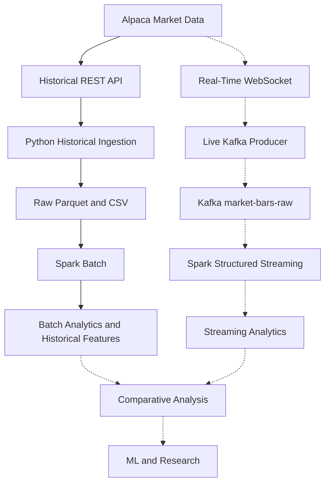
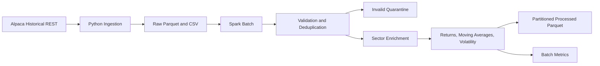
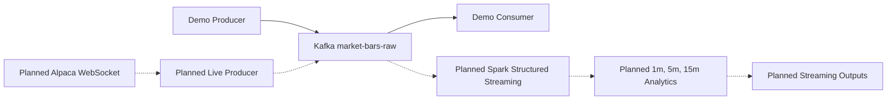
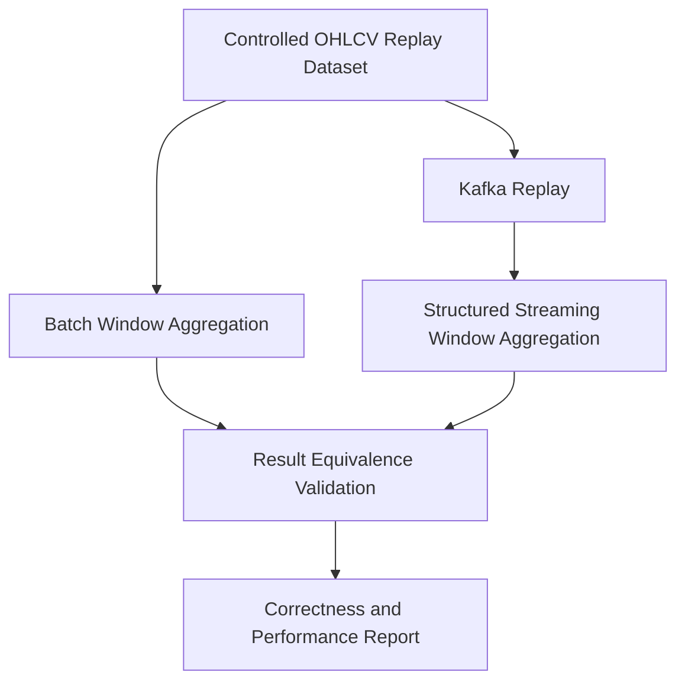

# Big Data Pipeline for Financial Market Analysis

## Project Objective

This university Big Data project studies financial market analysis through two
first-class processing paths: historical **Batch Analytics** and near-real-time
**Streaming Analytics**. Both paths use the same market domain, centralized symbol and
sector metadata, compatible OHLCV schemas, and equivalent mathematical definitions
wherever a metric exists in both modes.

The batch path is implemented through historical feature generation. The streaming
transport foundation is implemented through Kafka; live Alpaca ingestion, Spark
Structured Streaming, and streaming analytics remain planned phases.

## Academic Context

The scientific objective is to compare batch and streaming processing for correctness,
throughput, latency, completeness, resource use, and operational behavior. Later
experiments will replay equivalent market records through both paths and compare
windowed price, return, volume, and volatility results within defined numerical
tolerances. Existing batch benchmarks are preserved as baselines, not treated as
directly comparable to future streaming measurements until workload and environment
are controlled.

## Architecture Overview

Solid nodes describe implemented components. Dashed nodes describe planned work.

### Overall Architecture



### Batch Architecture



### Streaming Architecture



### Future Batch vs Streaming Comparison



## Technologies

- Python 3.11+
- Alpaca Market Data API v2
- pandas and PyArrow
- Apache Spark / PySpark 4.0.1
- Eclipse Temurin Java 21 LTS
- Apache Kafka 4.3.1 in KRaft mode
- Confluent Python client for Apache Kafka
- Docker Compose for local Kafka infrastructure
- YAML configuration and environment variables
- pytest

Spark Structured Streaming, live Alpaca WebSocket ingestion, machine learning, and
paper trading are future phases and are not implemented yet.

## Project Structure

```text
.
|-- config/
|   `-- config.yaml
|-- docker-compose.yml
|-- data/
|   |-- raw/
|   `-- processed/
|-- notebooks/
|   `-- 01_data_exploration.ipynb
|-- src/
|   |-- config/
|   |-- ingestion/
|   |-- kafka/
|   |   |-- create_topics.py
|   |   |-- demo_consumer.py
|   |   |-- demo_producer.py
|   |   |-- event_codec.py
|   |   `-- producer.py
|   |-- metrics/
|   |   `-- pipeline_metrics.py
|   |-- models/
|   |-- processing/
|   |-- spark/
|   |   |-- batch_processor.py
|   |   `-- transformations.py
|   |-- storage/
|   `-- main.py
|-- tests/
|   |-- test_alpaca_client.py
|   |-- test_kafka_event_codec.py
|   |-- test_kafka_producer.py
|   |-- test_normalization.py
|   |-- test_parquet_storage.py
|   |-- test_settings.py
|   `-- test_spark_batch.py
|-- README.md
`-- requirements.txt
```

## Setup

Create and activate a virtual environment:

```powershell
python -m venv .venv
.\.venv\Scripts\Activate.ps1
python -m pip install -r requirements.txt
```

Alpaca ingestion reads these environment variables, including from a local `.env`:

```env
APCA_API_KEY_ID=your_key_here
APCA_API_SECRET_KEY=your_secret_here
```

The Spark batch command does not load or require Alpaca credentials.

## Streaming Pipeline: Kafka Infrastructure

**Objective:** Phase 2 establishes and verifies the transport boundary that the live
Alpaca source and Spark Structured Streaming will use. It currently proves
`Demo Producer -> Kafka -> Demo Consumer`; it does not yet perform streaming analytics.

**Architecture and technologies:** A local single-node Apache Kafka 4.3.1 broker runs
in KRaft mode through Docker Compose, with no ZooKeeper dependency. Python clients use
`confluent-kafka`, and broker data persists in the `kafka-data` Docker volume.

**Configuration:** The `kafka` section of `config/config.yaml` defines bootstrap
servers, topic names, consumer-group prefix, client ID, partition count, replication
factor, and consumer timeout. No credentials are required for the local broker.

**Input, processing, and output:** The demo producer creates valid `MarketBar` objects,
the shared codec serializes them as versioned JSON, and `MarketBarProducer` publishes
them to `market-bars-raw` with `symbol` as the record key. The demo consumer decodes and
validates each record, verifies key/payload agreement, prints Kafka metadata and the
event, and commits the offset synchronously.

Start the broker and create the configured topics:

```powershell
docker compose up -d
docker compose ps
python -m src.kafka.create_topics
```

The topic command is idempotent. It creates:

- `market-bars-raw`: normalized market bar events
- `market-bars-dlq`: reserved for malformed or unprocessable events in later phases

Both topics use six partitions locally. A single broker requires replication factor
one; a multi-broker deployment should raise that value.

Start the demo consumer in one terminal:

```powershell
python -m src.kafka.demo_consumer --max-messages 10
```

Then publish deterministic events from another terminal:

```powershell
python -m src.kafka.demo_producer --count 10 --symbols AAPL MSFT
```

Each consumed line includes the topic, partition, offset, key, and decoded event. The
consumer validates that the Kafka key matches the payload symbol before committing its
offset. Stop the broker with `docker compose down`; add `-v` only when the persisted
local Kafka data should also be removed.

### Kafka Event Contract

`market-bars-raw` values are compact UTF-8 JSON with this shape:

```json
{"timestamp":"2026-09-29T14:30:00Z","symbol":"AAPL","open":100.0,"high":101.0,"low":99.5,"close":100.25,"volume":1000}
```

The Kafka record key is the uppercase `symbol`, preserving per-symbol ordering within
a partition. There is no global ordering guarantee across partitions. Headers contain
`event_type=market_bar` and `schema_version=1`; consumers can reject or route unknown
versions without guessing their schema. Sector is intentionally absent: consumers
enrich symbols from the centralized `symbols` mapping in `config/config.yaml`,
preventing duplicated reference data in every event.

| Field | JSON type | Meaning | Example | Validation |
|---|---|---|---|---|
| `timestamp` | string | Bar event time normalized to UTC | `2026-09-29T14:30:00Z` | Timezone-aware ISO 8601 |
| `symbol` | string | Uppercase market symbol | `AAPL` | Non-empty after normalization |
| `open` | number | Opening price | `100.0` | Finite, non-negative, within low/high |
| `high` | number | Highest price | `101.0` | Finite, non-negative, not below OHLC |
| `low` | number | Lowest price | `99.5` | Finite, non-negative, not above OHLC |
| `close` | number | Closing price | `100.25` | Finite, non-negative, within low/high |
| `volume` | integer | Traded volume represented by the bar | `1000` | Non-negative integer |

The codec applies the same basic market-bar validity rules used by the batch path:
finite and non-negative OHLC values, consistent high/low bounds, non-negative integer
volume, and a timezone-aware timestamp.

### Kafka Testing and Runtime Verification

Unit tests cover JSON round trips, required fields, invalid values, schema headers,
and symbol-key publication. Runtime verification used Docker Desktop 29.8.1, Docker
Compose 5.5.1, Kafka 4.3.1, and `confluent-kafka` 2.15.1:

- Broker health check passed on `localhost:9092`.
- `market-bars-raw` and `market-bars-dlq` each had six healthy partitions.
- Topic creation was idempotent.
- Ten events were acknowledged, consumed, decoded, and key-validated.
- Five AAPL events remained ordered in partition 0.
- Five MSFT events remained ordered in partition 1.

This ten-event smoke workload verifies transport correctness; it is not a throughput or
latency benchmark and is not directly comparable with the batch benchmark files. A
future Kafka benchmark will persist environment, workload, event-rate, and latency
measurements under `benchmarks/` without replacing existing results.

### Kafka Limitations and Future Integration

The current broker is a local development topology with one broker and replication
factor one, so it provides no broker-level fault tolerance. Authentication, TLS, dead
letter publication, retention tuning, production monitoring, and load benchmarks are
not yet implemented. `market-bars-dlq` is provisioned but no producer writes to it yet.

Phase 3 will map authenticated Alpaca WebSocket bar messages into the existing
`MarketBar` model and call the existing producer. Phase 4 will parse the same JSON from
`market-bars-raw`, use `timestamp` for event-time processing, and enrich sector from
central configuration before later 1, 5, and 15-minute analytics. Neither integration
requires redesigning the Kafka topics or payload.

## Java Runtime on Windows

Java 21 LTS is the verified project JDK. Install Eclipse Temurin 21 in PowerShell:

```powershell
winget install --id EclipseAdoptium.Temurin.21.JDK -e
```

Open a new terminal. If the installer did not configure `JAVA_HOME`, set it in
Windows System Properties > Environment Variables to the installed JDK directory,
then add `%JAVA_HOME%\bin` to `Path`. Verify:

```powershell
java -version
javac -version
$env:JAVA_HOME
```

For a temporary PowerShell session configuration:

```powershell
$env:JAVA_HOME="C:\Program Files\Eclipse Adoptium\jdk-21.0.12.101-hotspot"
$env:Path="$env:JAVA_HOME\bin;$env:Path"
```

## Configuration

[config/config.yaml](config/config.yaml) centrally defines symbols and sectors:

- Technology: AAPL, MSFT, NVDA, GOOGL, AMD
- Healthcare: JNJ, PFE, LLY, MRK, ABBV
- Defense: LMT, NOC, GD, RTX, HII
- Aerospace: BA, TDG, HEI, TXT, GE
- Energy: XOM, CVX, COP, SLB, OXY
- Financial: JPM, BAC, GS, MS, V

Add a symbol and its sector under `symbols` to extend both ingestion and Spark
enrichment. The `spark` section controls the application name, local master, input,
valid output, invalid output, and metrics paths.

## Market Universe

The verified universe intentionally contains 30 companies across six sectors, enabling
both individual-company analysis and later `groupBy("sector")` comparisons. Defense
and Aerospace remain separate project classifications even where business activities
overlap.

The originally proposed Aerospace ticker `SPR` was replaced by `GE`: Alpaca reported
SPR as inactive and non-tradable and returned no IEX bars for the configured period.
GE was verified as active, tradable, and available through the same feed and period.
All other proposed symbols were active and returned usable historical bars.

## Batch Pipeline

The batch path remains an active analytical path, not legacy setup. It converts a
configurable historical period into validated, sector-enriched, per-symbol time series
that support company, sector, and later cross-path analysis.

### Historical Ingestion

```powershell
python -m src.main
```

This writes one raw Parquet file and one CSV file per symbol, for example:

```text
data/raw/AAPL/2026-09-01_2026-09-20_1Min.parquet
data/raw/AAPL/2026-09-01_2026-09-20_1Min.csv
```

### Spark Batch Processing

Process every configured symbol that has raw data:

```powershell
python -m src.spark.batch_processor
```

Process one or more selected symbols:

```powershell
python -m src.spark.batch_processor --symbols AAPL
python -m src.spark.batch_processor --symbols AAPL MSFT
```

Spark reads only raw Parquet files. It does not call Alpaca. Valid processed data is
written under `data/processed/batch`, partitioned by symbol. Re-running a batch uses
dynamic partition overwrite, so selected symbol partitions are replaced rather than
appended.

Full runs replace stale generated partitions, while raw folders outside the configured
universe remain untouched.

On local Windows systems without Hadoop's native `winutils.exe`, Spark performs all
transformations and the pipeline uses a schema-preserving PyArrow writer for local
partition persistence. This avoids introducing an unverified native executable.

### Batch Data Quality

Every raw row receives `is_valid` and `validation_errors`. Validation covers required
values, OHLC consistency, non-negative prices, and non-negative volume. Quality-invalid
records are preserved under `data/processed/invalid`.

`symbol + timestamp` is the logical identity. Quality-valid duplicate extras are
marked with `duplicate_symbol_timestamp`, moved to the invalid dataset, and excluded
from financial calculations. One deterministic row remains in the valid dataset.
Nothing is silently discarded.

Metric meanings:

- `valid_row_count`: quality-valid rows before deduplication.
- `invalid_row_count`: rows failing financial data-quality checks.
- `duplicate_count`: duplicate extras among quality-valid rows.
- `output_row_count`: quality-valid rows after deduplication.

### Batch Output Schema and Financial Features

The valid output contains:

```text
timestamp, symbol, sector, open, high, low, close, volume,
validation_errors, is_valid, previous_close, price_change, return_pct,
log_return, previous_volume, volume_change, ma_5, ma_15, ma_30,
rolling_volatility_30
```

All lag and rolling calculations partition by `symbol` and order by `timestamp`.
Moving averages require their complete 5, 15, or 30-row history. Volatility is the
sample standard deviation of 30 returns. Values remain null until sufficient history
exists. A previous close of zero also produces null percentage and log returns.

## Shared Analytical Definitions

Batch currently implements the definitions below. Future streaming implementations
must preserve the same mathematics even when event-time windows require different
Spark APIs:

- `price_change = close_t - close_(t-1)`
- `return_pct = (close_t - close_(t-1)) / close_(t-1)` when the previous close is positive
- `log_return = ln(close_t / close_(t-1))` when both closes are positive
- `volume_change = volume_t - volume_(t-1)`
- `ma_N = arithmetic mean of the current and previous N-1 closes` after N observations
- `rolling_volatility_30 = sample standard deviation of 30 return_pct observations`

For later equivalence experiments, window boundaries, event ordering, null warm-up
behavior, sample versus population standard deviation, and numerical tolerance must be
declared before comparing batch and streaming results.

## Batch Metrics and Benchmarks

Each run logs and saves `data/processed/batch_metrics.json` with:

- Input, quality-valid, invalid, duplicate, and output row counts
- Processing duration and input rows per second
- Number and names of processed symbols
- Input and output sizes in bytes

These metrics form the batch baseline for the later streaming comparison.

### Initial Verified Batch Baseline

Recorded on Windows with Python 3.11.9, Eclipse Temurin Java 21.0.12.1, Spark
4.0.1, and PySpark 4.0.1:

- Symbols: 5
- Input rows: 25,570
- Output rows: 25,570
- Input size: 662,852 bytes
- Output size: 2,292,802 bytes
- Processing duration: 25.607 seconds
- Throughput: 998.548 rows/second
- Invalid rows: 0
- Duplicate rows: 0

This is an initial local-development baseline, not a controlled performance study.

### Expanded Universe Batch Baseline

The verified 30-symbol, six-sector run produced:

- Input/output rows: 113,988
- Input size: 2,857,816 bytes
- Output size: 9,880,026 bytes
- Processing duration: 52.706 seconds
- Throughput: 2,162.713 rows/second
- Invalid rows: 0
- Duplicate rows: 0

An idempotency rerun retained the same rows, partitions, and byte size. Full benchmark
records are stored separately in `benchmarks/batch_5_symbols.json` and
`benchmarks/batch_30_symbols.json`.

## Testing

Run all tests:

```powershell
python -m pytest
```

Run only non-Spark tests:

```powershell
python -m pytest tests/test_alpaca_client.py tests/test_normalization.py tests/test_parquet_storage.py
```

Validate an actual generated batch dataset:

```powershell
python scripts/validate_batch_output.py
```

Validate all configured raw datasets:

```powershell
python scripts/validate_raw_data.py
```

Spark tests use small in-memory deterministic datasets and never call Alpaca. The
Kafka unit tests do not require a broker; the documented runtime smoke test does. The
complete suite currently contains 25 passing tests with no failures or skips and is
verified on Java 21. The 17 emitted warnings are upstream PySpark/Pandas deprecation
warnings.

## Known Limitations

- Historical and planned live coverage use [Alpaca's IEX feed](https://docs.alpaca.markets/us/docs/market-data-faq),
  which represents one exchange rather than the consolidated US market and therefore
  reports lower volume than SIP data.
- The local Kafka topology has one broker and replication factor one.
- The ten-event Kafka run is a transport smoke test, not a performance benchmark.
- Alpaca live ingestion and Spark Structured Streaming are not implemented yet.
- Current batch features are row-count windows, not elapsed-time windows; missing
  market intervals can therefore affect comparisons with future event-time windows.
- Current benchmarks were captured on one Windows development machine and cannot be
  generalized as cluster-scale performance.

## Current Status

Implemented and runtime verified:

- Alpaca historical API client with pagination
- OHLCV normalization and ingestion validation
- Raw CSV and Parquet persistence
- Central symbol/sector configuration
- Verified 30-company, six-sector historical market universe
- Per-symbol ingestion failure isolation and summary reporting
- Independent Spark batch input discovery for one, multiple, or all symbols
- Spark validation, quarantine, deterministic deduplication, and sector enrichment
- Lagged returns, moving averages, and rolling volatility
- Idempotent partitioned processed Parquet output
- Reusable JSON batch metrics
- Unit and deterministic Spark tests
- Real full and selected-symbol batch execution on Java 21
- Output schema, uniqueness, sector, feature, null-window, and idempotency validation
- Separate five-symbol and expanded-universe benchmark artifacts
- Versioned JSON market-bar event codec and validation tests
- Symbol-keyed idempotent Kafka producer
- Validating demo Kafka consumer with explicit offset commits
- Idempotent Kafka topic administration
- Single-node Apache Kafka KRaft Docker Compose definition
- Healthy Kafka 4.3.1 runtime with six partitions per topic
- Verified ten-event AAPL/MSFT producer-to-consumer transport

Planned, not implemented:

- Alpaca real-time WebSocket ingestion
- Spark Structured Streaming
- Event-time windows and streaming analytics
- Streaming sector enrichment and analytics
- Batch analytics extensions for equivalent window and sector studies
- Batch vs streaming correctness and performance experiments
- Advanced indicators and machine-learning models
- Paper trading

## Next Steps Roadmap

Recommended order is Phase 2 through Phase 10 because each phase establishes the
contracts, data, or measurements required by the following phase.

### Phase 2 - Kafka Infrastructure

- **Status:** Implemented and runtime verified with Docker Desktop 29.8.1 and Compose 5.5.1.
- **Architecture change:** Added a broker between future producers and consumers, with `market-bars-raw` and `market-bars-dlq` topics.
- **Files/components:** Docker Compose, topic administration, centralized configuration, demo producer/consumer, and a versioned JSON contract.
- **Technologies:** Apache Kafka 4.3.1 in KRaft mode, Docker Compose, and `confluent-kafka`.
- **Tests:** Serialization round trip, validation, schema headers, and symbol-key behavior.
- **Expected output:** A repeatable broker and normalized event contract ready for live bars and Spark.
- **Dependency:** Phase 1 schema and symbol configuration.
- **Complexity:** Medium.

### Phase 3 - Alpaca Real-Time Streaming

- **Objective:** Publish normalized live Alpaca bars to Kafka.
- **Architecture change:** Add `Alpaca WebSocket -> MarketBar -> existing Kafka producer -> market-bars-raw` beside the independent historical path.
- **Endpoint:** Use the documented [Alpaca stock WebSocket](https://docs.alpaca.markets/us/docs/real-time-stock-pricing-data) at `wss://stream.data.alpaca.markets/v2/iex` for the configured IEX feed and the Alpaca test endpoint for deterministic off-hours verification.
- **Authentication/subscription:** Follow the documented [connection protocol](https://docs.alpaca.markets/us/docs/streaming-market-data): authenticate once per connection with the existing API key and secret, wait for confirmation, then subscribe to the `bars` channel for configured symbols.
- **Mapping:** Convert Alpaca `T=b`, `t`, `S`, `o`, `h`, `l`, `c`, and `v` fields to the existing `MarketBar`; ignore unrelated message types after handling protocol messages.
- **Resilience:** Add configurable exponential reconnect backoff with jitter, clean cancellation, bounded buffering, and explicit handling for authentication, entitlement, connection-limit, slow-client, malformed-message, and Kafka-delivery failures.
- **Files/components:** Async WebSocket client, live-bar mapper, orchestration entry point, streaming settings, producer lifecycle handling, and producer metrics.
- **Technologies:** Alpaca stock WebSocket API, `asyncio`, a maintained WebSocket client, existing `confluent-kafka` producer, and structured logs.
- **Tests:** Mock connect/authenticate/subscribe flows, bar mapping, unrelated/control messages, malformed events, reconnect/backoff, shutdown flush, and a local Kafka integration test.
- **Runtime verification:** First use Alpaca's always-available test stream, then verify permitted IEX symbols during market hours and record observed messages, duration, events/second, reconnects, and delivery failures.
- **Expected output:** Symbol-keyed normalized events on `market-bars-raw`.
- **Dependency:** Phase 2 broker and message contract.
- **Complexity:** High.

### Phase 4 - Spark Structured Streaming

- **Objective:** Consume Kafka events reliably and create processed streaming data.
- **Architecture change:** Add `Kafka -> Spark Structured Streaming -> Parquet` with durable checkpoints.
- **Files/components:** Streaming entry point, explicit event schema, Kafka reader, checkpoint configuration, watermark/deduplication logic, and output writer.
- **Technologies:** Spark Structured Streaming, Kafka connector, Parquet.
- **Tests:** Schema decoding, event-time handling, checkpoint restart, late records, duplicate events, and local Kafka-to-Spark integration.
- **Expected output:** Validated, deduplicated event-time streaming records and rejected records, ready for analytical windows.
- **Dependency:** Phases 2 and 3.
- **Complexity:** High.

### Phase 5 - Streaming Financial Analytics

- **Objective:** Produce useful near-real-time market aggregates.
- **Architecture change:** Add windowed analytics after streaming validation.
- **Files/components:** Window transformations, analytics sinks, anomaly rules, and metric definitions.
- **Technologies:** Spark SQL windows and Structured Streaming state.
- **Tests:** Average/min/max price, volume, event count, first/last price, short return, volatility, sector enrichment, configurable detections, and late-window updates.
- **Expected output:** Per-symbol and per-sector 1, 5, and 15-minute analytics outputs.
- **Dependency:** Phase 4 event-time pipeline.
- **Complexity:** Medium.

### Phase 6 - Batch Analytics Extension

- **Objective:** Add historical symbol, sector, and time-window analytics equivalent to the streaming measures where appropriate.
- **Architecture change:** Extend the first-class batch path after feature generation.
- **Analytics:** Average/min/max price, volume, first/last price, return, volatility, best/worst performers, and stock/sector correlations over configurable periods.
- **Tests:** Symbol isolation, sector completeness, window boundaries, formulas, correlations, and missing intervals.
- **Expected output:** Historical per-symbol and per-sector analytical datasets.
- **Dependency:** Stable Phase 1 batch output and Phase 5 metric definitions.
- **Complexity:** Medium.

### Phase 7 - Batch vs Streaming Equivalence

- **Objective:** Establish numerical correctness across both processing paradigms.
- **Architecture change:** Add a controlled OHLCV replay workload and shared expected results.
- **Tests:** Feed identical 1, 5, and 15-minute sequences through both paths and reconcile average/min/max price, volume, return, and volatility within declared tolerances.
- **Expected output:** Persisted correctness report with inputs, formulas, precision, mismatches, and explanations.
- **Dependency:** Phases 4-6.
- **Complexity:** High.

### Phase 8 - Batch vs Streaming Performance

- **Objective:** Compare throughput, latency, resource use, completeness, lag, late events, and stability under controlled workloads.
- **Files/components:** Benchmark runner, resource sampler, Kafka lag collection, Spark progress listener, experiment manifests, tables, and charts.
- **Expected output:** New `benchmarks/streaming_*.json` and `benchmarks/batch_vs_streaming_*.json` artifacts without replacing historical batch baselines.
- **Dependency:** Phase 7 correctness baseline.
- **Complexity:** High.

### Phase 9 - Advanced Features and Machine Learning

- **Objective:** Build leakage-aware indicators and evaluate models only after both data paths are validated.
- **Features:** RSI, MACD, EMA, Bollinger Bands, momentum, volatility, and volume indicators where scientifically justified.
- **Models:** Begin with transparent baselines and temporal splits before considering more complex models.
- **Tests:** Formula fixtures, warm-up behavior, symbol isolation, label alignment, no future leakage, deterministic temporal splits, and model smoke tests.
- **Expected output:** Versioned feature datasets, evaluation reports, and reproducible model artifacts.
- **Dependency:** Phases 6-8.
- **Complexity:** High.

### Phase 10 - Final Validation and Scientific Paper

- **Objective:** Make the project reproducible and communicate defensible findings.
- **Architecture change:** Freeze versioned configurations, datasets, experiments, and diagrams into a final release.
- **Files/components:** Reproduction script, final test suite, architecture diagrams, experiment manifests, paper, appendices, and 10-minute presentation.
- **Technologies:** Existing stack plus a document/presentation toolchain.
- **Tests:** Clean-machine reproduction, full integration run, data checksums, result regeneration, citation review, and presentation timing.
- **Expected output:** Final datasets, models, benchmark evidence, limitations, conclusions, scientific paper, and presentation.
- **Dependency:** All selected earlier phases.
- **Complexity:** High.
