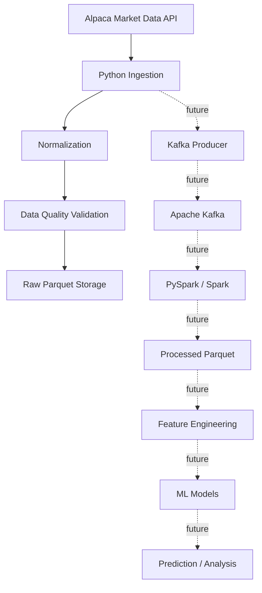

# Big Data Pipeline for Financial Market Analysis

Master's Big Data Laboratory project for collecting Alpaca Market Data, storing normalized market bars, and preparing an extensible pipeline for later Kafka, Spark, feature engineering, and ML experiments.

## Objective

The initial goal is to build a clean first vertical slice:

- Load project configuration.
- Read Alpaca credentials from environment variables.
- Retrieve historical OHLCV stock bars from Alpaca Market Data API v2.
- Normalize records into a consistent schema.
- Validate basic data quality.
- Store raw normalized datasets as Parquet.

ML models, Kafka, Spark processing, paper trading, and strategy evaluation are planned future work and are intentionally not implemented yet.

## Initial Architecture



## Technologies

- Python 3.12+
- Alpaca Market Data API v2
- requests
- pandas
- PyYAML
- python-dotenv
- Parquet with pyarrow
- Jupyter Notebook
- pytest
- Kafka, Spark, and Docker Compose planned for later stages

## Folder Structure

```text
.
├── README.md
├── .env.example
├── .gitignore
├── requirements.txt
├── config/
│   └── config.yaml
├── data/
│   ├── raw/
│   └── processed/
├── notebooks/
│   └── 01_data_exploration.ipynb
├── src/
│   ├── config/
│   ├── ingestion/
│   ├── models/
│   ├── processing/
│   ├── storage/
│   └── main.py
└── tests/
```

## Setup

Create and activate a virtual environment:

```bash
python -m venv .venv
```

On Windows PowerShell:

```powershell
.\.venv\Scripts\Activate.ps1
```

Install dependencies:

```bash
pip install -r requirements.txt
```

## Alpaca Credentials

Create a local `.env` file in the project root:

```env
APCA_API_KEY_ID=your_key_here
APCA_API_SECRET_KEY=your_secret_here
```

The `.env` file is ignored by Git. Use `.env.example` as the template.

## Configuration

Edit [config/config.yaml](config/config.yaml) to change symbols, date range, timeframe, limit, feed, and output location.

Default symbols:

- AAPL
- MSFT
- NVDA
- TSLA
- AMZN

## Run Ingestion

```bash
python -m src.main
```

The command saves one Parquet file per symbol, for example:

```text
data/raw/AAPL/2026-09-01_2026-09-20_1Min.parquet
```

## Run Tests

```bash
pytest
```

## Current Status

Implemented:

- Project skeleton.
- Configuration loading.
- Alpaca historical bars client with pagination.
- Normalization to `timestamp, symbol, open, high, low, close, volume`.
- Basic data-quality validation.
- Parquet persistence.
- Unit tests with mocked HTTP responses.

Not implemented yet:

- Kafka producer/consumer.
- Spark jobs.
- Feature engineering.
- ML model training and validation.
- Paper trading integration.
- Scientific paper and final analysis.

## Planned Next Steps

1. Add Docker Compose for Kafka and Spark.
2. Introduce a producer interface for streaming market bars.
3. Add Spark batch processing for raw-to-processed Parquet datasets.
4. Add feature engineering notebooks.
5. Add baseline ML models and validation metrics.
6. Add experiment tracking and result analysis.
